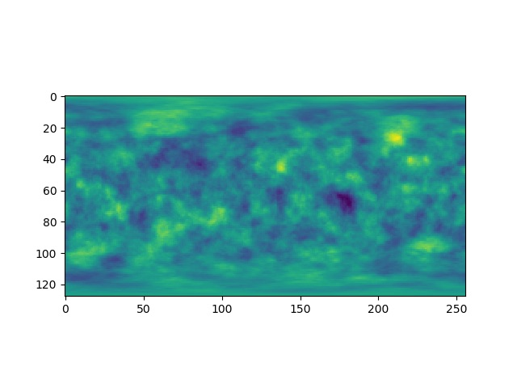
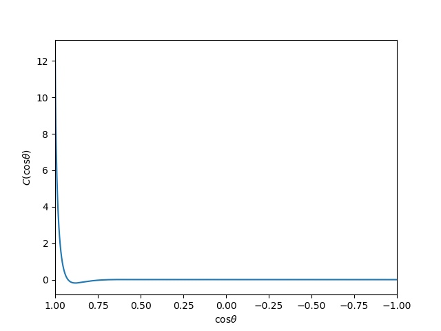

smerfs
======


### Stochastic Markov Evaluation of Random Fields on the Sphere

This code is based on the paper "Fast generation of isotropic Gaussian random fields on the sphere" by Peter Creasey and Annika Lang (Monte Carlo Methods and Applications, 24, 1–11, [arxiv](https://arxiv.org/abs/1709.10314), [published version](https://doi.org/10.1515/mcma-2018-0001)).

Once you have downloaded Smerfs you will probably want to do the following:

## Install

Install (also builds the C-functions)

```bash
python setup.py install [--prefix=/myhome/my-site-packages]
```
and run the tests,
```bash
python setup.py test
```
(use `-v` verbose or `-vs` for really verbose)

Add smerfs to your PYTHONPATH, perhaps in your .profile e.g.
```bash
PYTHONPATH="${PYTHONPATH}:${HOME}/codes/smerfs"
export PYTHONPATH
```

## Examples
These probably need at least python 2.7 and a (non-ancient) numpy and scipy. 

### Realise a spherical field with a given power spectrum
    
In a python environment try
    
```python
from smerfs import build_filter
import numpy as np
import matplotlib.pyplot as pl
nz = 128 # 128 points equally spaced in theta (z=cos(theta))
nphi = 256 # I usually use nphi=2*nz so regular pixels at equator
# GRF with C_lambda = 1/(1.0 + 10^-4 (lambda(lambda+1))^2)
coeffs = (1.0, 0.0, 1e-4) # this has length scale around l=10
sf = build_filter(nz=nz, nphi=nphi, coeffs=coeffs, dtype=np.float64) # Build the filter coefficients
# Make an example realisation
res = sf.create_realisation() # has shape (nz, nphi)
pl.imshow(res) # Plot
pl.show()
```

which should produce something like


### Plot the covariance function 

You can see the covariance as a function of angular separation with

```python
from smerfs.utils import analytic_cov
z = np.linspace(-1,1, 1000)
correl = analytic_cov(coeffs, z) # Contributions from Legendre polynomials
pl.plot(z, correl)
pl.xlabel(r'$\cos \theta$')
pl.ylabel(r'$C(\cos \theta)$')
pl.xlim(1,-1)
pl.show()
```

which should produce something like


All of these are equivalent to running

```
python examples/example1.py
```

### Saving the filters

If you plan to re-use the filter coefficients for a given power spectrum you (construction being the slowest part of the process) you can store the filters with

```python
from smerfs import build_filter, load_filter
sf = build_filter(nz,nphi, coeffs, dtype=dtype)
sf.save('filter.dat')

# Load it again 
sf = load_filter('filter.dat')
```

Although every effort has been made to keep the file sizes small (e.g. using symmetry to avoid storing coefficients for the lower half of the sphere, keeping only the lower-triangle of the matrix decomposition), you may also wish to use `dtype=numpy.float32` for large filters to halve the file size (with corresponding loss of precision). Note this uses `pickle` internally, which can be a security issue if you are using filters from unknown sources.
